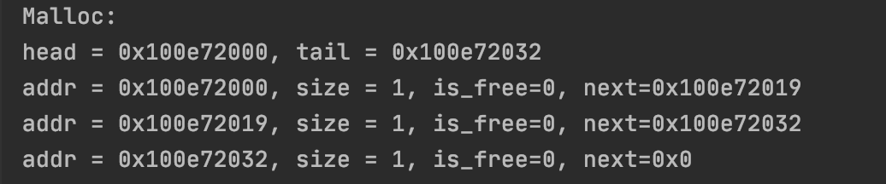
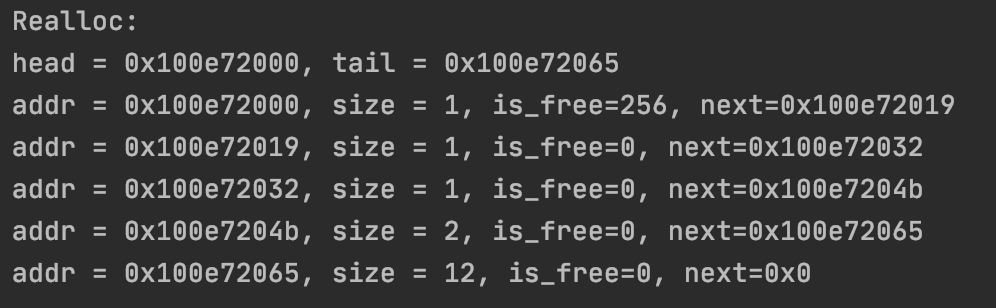
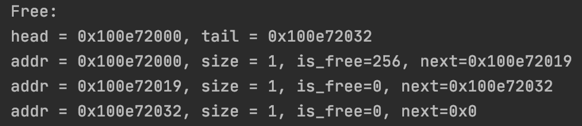

# LabaOS1: Memory Allocator
Опиc

Лабораторна робота по створенню розподільника пам'яті на С ++.
Реалізація базується на байтовому масиві з метою вивчення та тестування алгоритму розподілення пам'яті.
Розподілення пам'яті надає розробнику контроль над пам'яттю, що дозволяє не тільки оптимізувати використання пам'яті,
але і поліпшити швидкість дії програми порівняно зі стандартним складальником сміття.

Опис алгоритму

Ця реалізація використовує покажчики C ++ для переміщення між блоками в пам'яті.
Кожен блок складається з двох частин: заголовку та даних.
Розмір заголовку сталий і дорівнює 17 байтам.
Він складається з 3х полів, в яких зберігається інформація про те, чи зайнятий блок (1 байт),
розмір частини даних цього блоку (8 байта) і розмір попереднього блоку (8 байта).

void* memory_allocator(size_t size)

Ця функція виділяє новий блок пам'яті необхідного розміру.
Виконує поставлену задачу за рахунок пошуку кращого рішення.
memory_allocator переглядає всю пам'ять, щоб знайти найменший порожній блок, 
в якому досить пам'яті для виділення нового блоку необхідного розміру.
Цей підхід забезпечує раціональне використання пам'яті,
щоб користувач міг зберігати як можна більший обсяг даних.

void* memory_reallocator(void* pointer, size_t size)
Використовується, коли користувачу потрібно змінити розмір певного блоку пам'яті.
`Pointer` - покажчик на блок, розмір якого користувач хоче змінити.
`Size` - це новий розмір цього блоку.

Поведінка

-- Якщо необхідний розмір блоку менше поточного:
поточний блок буде розділений на дві частини.
Перша частина розміщується і повертається в результаті функції.
Другий також стає блоком, і виконується операція mem_free,
щоб звільнити блок і об'єднати його з наступним блоком, якщо наступний блок порожній.
-- Якщо необхідний розмір блоку менше поточного, є два можливих варіанта:
- Якщо наступний блок в поєднанні з поточним блоком дає більше місця,
 ніж достатньо для перерозподілу, наступний блок розділяється на дві частини.
  Перша частина об'єднується з першим блоком для створення нового блоку необхідного розміру. Друга частина використовується замість початкового другого блоку.
- Якщо другий блок порожній і для його поділу не залишилося місця, два блоки об'єднуються.
- Якщо жоден з попередніх варіантів не є можливий,
новий блок пам'яті виділяється за допомогою `memory_allocator`, а поточний блок очищається.

void memory_free (void * addr)
Функція видаляє дані блоку, позначає їх як блок «вільної пам'яті» і
намагається об'єднатися з сусідніми блоками «вільної пам'яті», якщо вони є.

Приклади використання
--- Розподілення 3х блоків по 1 байту ---
Приклад коду
```
    malloc(1);
    malloc(1);
    malloc(1);
```
Console Output


--- Reallocate блоку ---
Приклад коду
```
    realloc(head->next,12);
```
--- Console Output
---- Після Реалоку


--- Звільнення 1-го блоку пам'яті
---- Приклад коду
```
free(head->next);
```
--- Console Output
---- Після Звільнення

